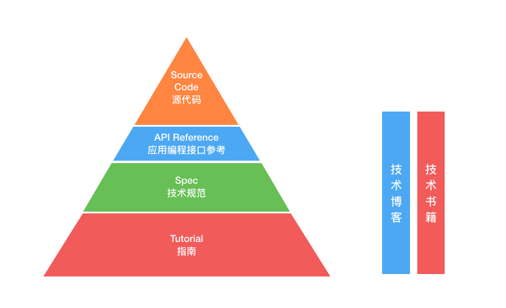
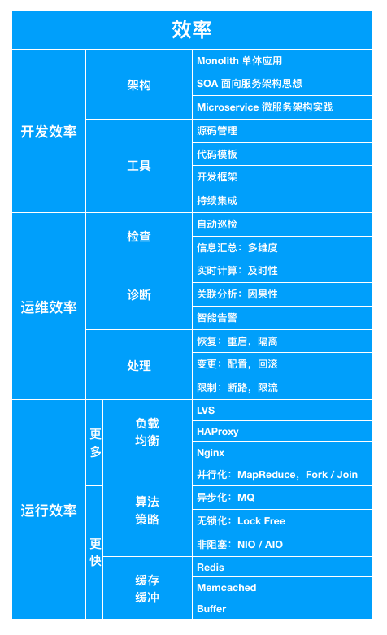
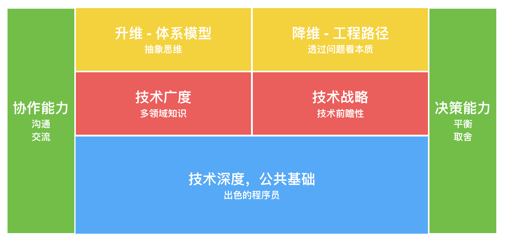
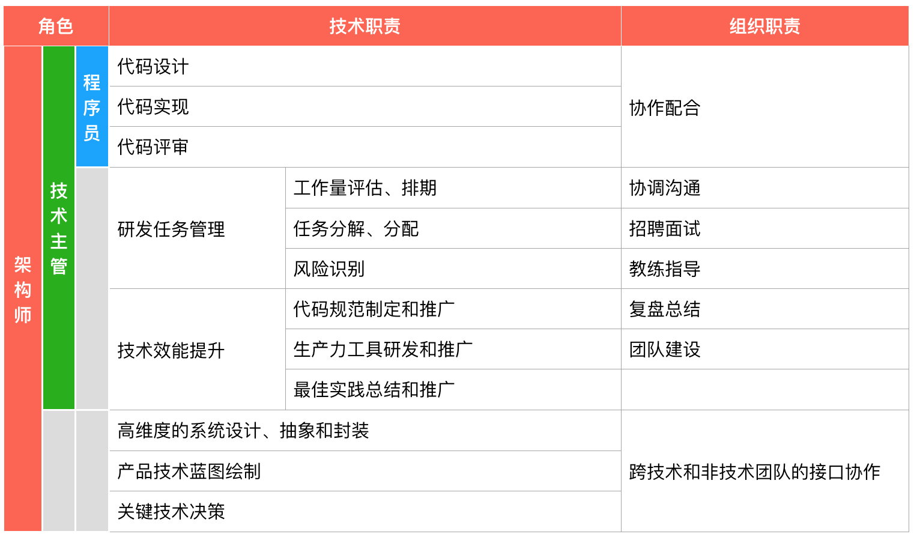
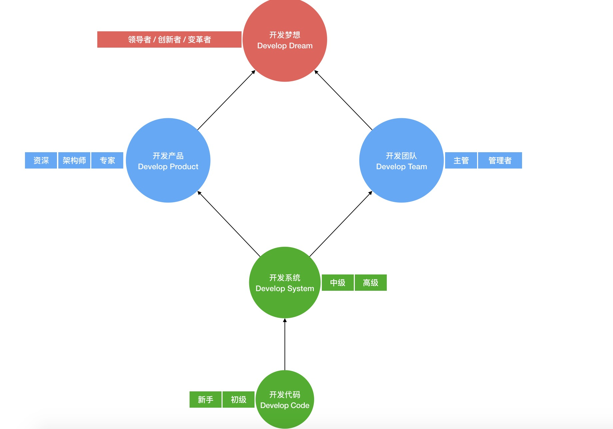

# be\_programmer

* [程序员进阶](be_programmer.md#程序员进阶)
* [始于知，终于行](be_programmer.md#始于知终于行)
  * [知](be_programmer.md#知)
  * [行](be_programmer.md#行)
* [初程](be_programmer.md#初程)
  * [为什么， 选什么， 做什么](be_programmer.md#为什么-选什么-做什么)
    * [为什么做一名程序员](be_programmer.md#为什么做一名程序员)
    * [选什么语言](be_programmer.md#选什么语言)
    * [做什么行业](be_programmer.md#做什么行业)
  * [出城](be_programmer.md#出城)
    * [基础及掌握](be_programmer.md#基础及掌握)
    * [离开校园](be_programmer.md#离开校园)
* [修炼](be_programmer.md#修炼)
  * [软件生命周期](be_programmer.md#软件生命周期)
  * [架构](be_programmer.md#架构)
  * [设计模式 框架](be_programmer.md#设计模式-框架)
  * [不要精益求精](be_programmer.md#不要精益求精)
  * [计划与执行](be_programmer.md#计划与执行)
  * [习惯](be_programmer.md#习惯)
  * [路径](be_programmer.md#路径)
  * [别怕失败， 尽情实验](be_programmer.md#别怕失败-尽情实验)
  * [提升效率](be_programmer.md#提升效率)
  * [转化](be_programmer.md#转化)
  * [如何处理倦怠感](be_programmer.md#如何处理倦怠感)
  * [突破](be_programmer.md#突破)
  * [选择？](be_programmer.md#选择)
  * [蓝图](be_programmer.md#蓝图)
* [代码进阶](be_programmer.md#代码进阶)
  * [认知篇](be_programmer.md#认知篇)
  * [规范篇](be_programmer.md#规范篇)
  * [编码规范](be_programmer.md#编码规范)

## 程序员进阶

## 始于知，终于行

之前看胡峰的文章，有篇文写的很好，现抄录如下 在回顾曾经写过的一些主题时，发现很多技术的内容可能都随着时间变迁过时了，但关于成长的认知却依旧历久弥新，因此选了这个关于成长的主题。 而成长的本质，就是两个字：**始于知，终于行**

### 知

知，起于阅读；当你决定学习一样东西时，自然就会从阅读开始。从阅读中学习，要么是直接获得知识，要么就是从别人的学习经历或经验中找到值得自身借鉴的参考与启发。

我硕士毕业于广州中山大学，一直让我铭记的是当年学校的校训，那是孙中山先生于 1924 年 11 月 11 日在广东大学（原校名，后为纪念孙中山先生改名）举行成立典礼时亲笔提写的十字训词：

博学 审问 慎思 明辨 笃行

这十字训词原文出自儒家经典《礼记·中庸》：“博学之，审问之，慎思之，明辨之，笃行之”，但孙中山先生赋予了它新时代的涵义。

“博学” 好理解，在校训牌旁边不远处就是陈寅恪的故居，陈寅恪是中国现代历史学家、古典文学研究家、语言学家、中央研究院院士、中华民国清华大学国学院四大导师之一（其余三人为梁启超、王国维、赵元任），通晓二十余种语言，堪称博学之人。

相比九十多年前孙中山先生的时代，今天是信息爆炸与过载的时代，知识与学问也淹没在这些爆炸的信息中，谁还能轻易堪称博学，我们只能说在信息的洪流中，保持永无止境地学习。如果能坚持学下去，那么今天的自己就比昨天的自己稍微博学一点，今年的自己也比去年的自己要博学一些。

正因为信息过载，我们通过各式各样的大量阅读来接收信息，因此对这些信息进行 “审问、慎思、明辨” 就显得十分重要和关键了。“问、思、辨” 是对信息进行筛选、分析与处理，去其糟粕取其精华。经过降噪、筛选、分析处理后的信息再与我们自身已有的知识和经验结合形成属于自己的独立思考与观点，而这些独立的思考和观点才能用来指导我们的行动，也即 “笃行”。

先有 “知”，方有 “行”。知，只是行的方法；行，才是知的目的。

### 行

在中大学习的年间，我每天早上去实验室，晚上又回来，多少次要从校训牌前来回经过。十多年后再回想当初在学校习得的那点知识和技能，要么已经过时，要么也遗忘殆尽了。最终留在心里的反倒是校训牌上那无比清晰的十字训词，并一直指导着我未来的学习与成长之路。

十字训词，前 8 字 4 词占了 80% 的文字内容，但我觉着用在上面的时间和精力应该正好反过来：花 20% 时间和精力研究如何更好地 “知”，而 80% 的时间和精力放在持续地 “行” 上。搞错了比例，很可能最终也就无所成就，收获寥寥。

但 “笃行” 往往是最消耗时间的阶段，一旦方向搞错了，可能大量的努力就浪费了。因此，“行” 之前的 “学、问、思、辨” 就很关键了，它们是行之前甚至行程中不断修正方向的指南针。

我的专栏能提供给你的也不过是我的一些经历、经验与思考，供你行路参考。你的阅读会让你更 “博学” 一点，但这只是第一步的信息传递与接收阶段，如果没有后面的 “问、思、辨、行”， 于你又有多大的意义呢？所以，后面的部分只能靠你自己来完成了。

纸上得来终觉浅，绝知此事要躬行。

在 “行” 的路上，也许一开始都是参照走前人走过的路，虽然我们经常想走自己的路，其实绝大部分人终其一生都是在走前人的路。写到这，想起一个前几年关于我自己的真实 “行路” 的感悟。

几年前，我考了驾照买了车，然后就跑去自驾。从成都出发，经过了红军长征走过的草原，绕过了青海湖边，经古代丝绸之路的路线一路开到了敦煌。丝绸之路从敦煌出去，分出两条，北上经玉门关，南下出阳关，走到那里突然有种诗和远方的感觉。

但无论自驾如何自由，我们也不过是在走前人的路。在敦煌的洞窟里看到了张大千临摹的笔迹，才了解到战争年代大师也曾在这里临摹古人的壁画，走着前人的路。

开着车走在路上，两边是沙漠，偶尔看见前面有车，超过，再前行，两边的沙漠变成戈壁，路看不到头，一望之下再也看不到其他的人和车，走在路上感觉有些心慌然，仅仅是走在前人的路上已有些慌然，那走出这条路的前人又该是怎样的心境？

回程中，入蜀后国道一来一去两条车道，车多起来了后都只能跟着走，大车在路上慢悠悠地挡着道，小车都会借道超车。借道本身是有一定危险的，超大车还好，如果前面是小车，本身开得不慢，跟着走是不是更能在安全和速度之间取得平衡？我试过跟着小车走，不超车，结果跟不了多久就跟丢了。

当你决定跟车时就放弃了超越的心，安稳是安稳些了，但节奏掌握在前车手里，最终只会被远远甩下。开车行路如此尚可，但人生之路终究是无法去跟住别人的，有一颗超越的心，按自己的节奏一直走下去，你终究会慢慢走出一条属于自己的路。

这条路，难不难走？难，感觉走不下去时，不妨读读李白的诗吧。

行路难！行路难！多歧路，今安在？

长风破浪会有时，直挂云帆济沧海。

## 初程

### 为什么， 选什么， 做什么

#### 为什么做一名程序员

我和大多是人一样都是高考之后的学校选择， 专业选择选了计算机， 才走上程序员道路。 可能很多人是为了爱好， 不过爱好是后天培养的， 所以大家一开始没兴趣也不要紧， 慢慢培养吧

#### 选什么语言

TIOBE 程序语言排行榜 是每年都会公布的， 如果做一个小白， 肯定还是要参考一下这个的， 作为一名老兵，我的经验告诉我第一门确实很重要。 虽然有一些流传的说法，类似于：“语言并不重要，必要的时候可以在各种语言间自由切换。”但实际情况是，能做到自由切换的前提是你得对一门语言掌握到通透之后，再学习其他语言才可能触类旁通。 但通常对一门语言精通， 要花数年时间。

我们有时候感到焦虑的原因在于，技术变化那么快，就怕自己选了一个方向，投了几年的时间、精力，最后却被技术迭代的浪潮拍在了沙滩上。

我个人是大学时学习的c，c\#，java。 到第一份工作做微软相关开发， 基本上固定在了c\# + js， 后来跳出来后也是在微软框架下兜兜转转。再后来跳出微软体系，我就转到了Python，Kubernetes， Go方向， 不出意外未来20年还是在这三个方向

#### 做什么行业

选择技术方向，选择语言，本质都是一种投资。选择做什么行业更是关系到生活质量的保证啊， 但这种一般只有优秀的人才有话语权的， 要不都是你没机会挑行业和公司的，所以同学们加油吧

### 出城

#### 基础及掌握

程序世界是一片广阔的大地， 掌握的越多， 才能做到凶中有沟壑

* 开发平台， 编程语言，平台生态 --跟紧开源， 社区，技术大拿
* 常用数据结构和算法

  ```text
  数组 Array
  链表 Linked List
  队列 Queues
  堆栈 Stacks
  散列 Hashes
  集合 Sets
  树 Trees
  图 Graphs
  ```

* 数据存储

  ```text
  SQL 关系型数据库（如：MySQL、Oracle）
  NoSQL 非关系型数据库（如：HBase、MongoDB）
  Cache 缓存（如：Redis、Memcached）
  ```

* 测试方法 了解测试驱动开发TDD， 只有真正懂得测试才能开发的更好
* 工程规范

  ```text
  代码结构
  代码风格
  ```

* 开发流程
* 源码管理

这这块的内容， 可以参考另外几篇文章关于设计模式， 效率

#### 离开校园

我不停的擦拭手中的利剑，不是因为我喜欢它，也不是因为它能带来安全，只是因为，每当下一次冲锋的号角响起时，我能够迅速拔出，纵横厮杀，直至战斗结束，不让自己倒下

离开校园后， 要融入一个好的团体， 不断打磨技术技艺

## 修炼


### 软件生命周期

1、问题定义   
 2、可行性研究   
 3、需求分析   
 4、概要设计（总体设计）   
 5、详细设计   
 6、编码和单元测试（编码占全部开发工作量的10%-20%）   
 7、综合测试（测试占全部开发工作量的40%-50%）   
 8、软件维护   


### 架构

架构是规划、设计和构建建筑及其物理结构的过程与产物。在计算机工程中，架构是描述功能、组织和计算机系统实现的一组规则与方法

1.用城市建筑设计类比软件架构   
 建筑架构的边界、区域划分：对应程序的功能模块划分   
 道路规划：软件接口与交互   
 2.软件开发   
 软件设计：需求分析、架构设计等，架构主要用在这一步   
 软件实现：变成代码并交付   
 3.架构的关注点：熵   
 熵表示软件系统的混乱程度，越大则表示越混乱，难以开发测试和维护   
 需求的堆积与变更：熵增   
 重构，架构升级：减少一部分熵   
 软件的生命周期内，就是在不断平衡熵，直到最后软件生命结束   
 4.实现的关注点：简（减）   
 简化软件代码，减少代码量，减少开发时间，减少测试时间，减少潜在bug数，减少未来的维护、理解与沟通成本   
 5.软件架构的断裂带：执行过程   
 多人协作，沟通协调   
 作为架构负责人：把控其他人产出是否没有超出架构边界，把自己的主要精力投入到战略性的问题上   
 6.架构实现能力的等效性   
 不同的架构表示的不同的结构与流程设计思想   
 同一个需求，可以用不同的架构实现，只是实现过程中的成本不同，因此架构实现能力是具有等效性的   
 根据实现成本、后期可扩展性等因素，选择合适的架构

### 设计模式 框架

设计模式是前任的经验总结， 是代码的复用设计理论   
 框架是一个可复用的设计组件， 是解决一系列问题的成功方法   


### 不要精益求精

绝大多数人都是从copy paste 开始， 这个是完全正确的， 因为从初级就是要这样一步步进步学习， 关键是看在paste之后是不是能转换成自己的知识。   
 当然这个只适合初期啊， 如果到中后期还这样， 基本上也没有成长了

在程序员初期， 其实不应过度关注代码精益， 或者任何奇淫技巧，也不要过度优化， 当然过度优化是在整个程序员体系里都不应该遵循的。过度精益和优化容器陷入误区， 或者影响交付速度， 可能你做了3天的东西各种完善， 最后用户说不是他想要的。 所以初期就要小步快跑， 多次迭代多次校准

### 计划与执行

这个话题不仅适用于程序员开发， 更适用于生活方方面面。 设定了计划， 就好好执行

如果收藏了太多的技术文档而不看， 那也只是收藏而已

目标OKR导向， 你要清晰目标是什么， 关键要做什么， 可以看另外一篇关于OKR的文章

### 习惯

如果你要构建一个习惯，就要运用好基因中本已存在的关于 “采集和狩猎” 的本能：高度专注，跨出边界，持续交付

### 路径

走完初级， 要经历一些更专业的学习了



### 别怕失败， 尽情实验

走出舒适区的一次行动， 验证猜想， 收获结果， 体验过程， 理解现实. 不断重复

### 提升效率



### 转化

走完修炼的过程， 下一阶段就是进阶了，是适合行程一套自己的技术体系或者技术领域了 ，然后向技术圈或者团队转化自己的技能输出

在领域知识体系中，“点” 是利器，“线” 是路径，“面” 是地图；而就我们个体而言，“点” 是孤立知识点的学习掌握，而 “线” 是对这些点的连接，“面” 则构成了完整的知识体系网。

看看程序设计相关的书、文章和博客；   
 参加一些技术主题论坛或会议；   
 写写技术博客；   
 创建自己的业余项目（Side Project）。   


### 如何处理倦怠感

生活娱乐工作三不误

### 突破

* 高

程序员—架构师—技术领导者   
 程序员—技术主管—管理者   


* 精

  走向专家之路，就是精确地找到、建立你的领域，并不断推高壁垒和扩大边界的过程。

### 选择？

程序员过了一定阶段， 就又到了通常大家所说的是选择管理岗位还是继续技术， 这个东西不是非黑即白， 通常是两者共存





### 蓝图



图中描述了好几个阶段，从一个阶段到下一个阶段，都会经历一次转折。

* 开发代码（Develop Code）   


  从刚走出学校到进入职场成为一名新手程序员，在最初的一两年内，你可能都处在这个阶段。不停地大量写代码，为各类系统的“大厦”添砖加瓦，像块海绵一样，把自己吸得满满的，朝 9 晚 24 地工作与学习，并不时自嘲为 “码农”。

这个阶段，你为生存所需（迫），会强烈地渴望成长。

* 开发系统（Develop System）   三、五年后，你可能从初级、中级成长到了高级，此时你不再仅仅是写代码搬砖，而是开始负责起或大或小的整个系统。这时，你最关心的是如何用最好的技术方案，去开发、优化和完善系统。
* 开发产品（Develop Product）   从高级走向资深、专家或架构师，你会发现你的技术执行技能已经优化到了相当的程度，这时往前多走一步，关注你所实现的系统所属的产品，会让你打开新的空间，找到更有效率和效果的实现路径，减少做无用功。

而且在技术的世界里，有很多面向开发者的技术型产品，这个领域中最适合承担起产品经理角色的就应该是各类资深的技术专家和架构师了。

* 开发团队（Develop Team）   当你选择走上技术主管并转变为一名管理者，那么人和团队将成为你的主要开发对象，而不再是代码了，这是成为管理者的必经之路。
* 开发梦想（Develop Dream）   梦想这个东西也会随着岁月与你相伴成长，梦想实际永远在前方，它只是不断引领着你往前走。梦想相对而言是一个感觉上很 “虚” 的概念，它可能需要产品作为载体，也需要团队来一起开发创造。如此，梦想的引力就会引发你向一名创新者或领导者的方向进化跃迁。比如说，十多年前，刚毕业时，我的梦想是成为一名架构师，如今已然实现。

以上这张图只是帮你看清从过去到未来的一条路，但如何走好这条路，就需要另一个视角维度的蓝图了。

文末贴上一份关于代码进阶的总结：

## 代码进阶

### 认知篇

你写的每一行代码，都是你的名片   
 1 我们总是先要解决掉数量问题，然后才能解决掉质量问题？ 看山不是山   
 2 看代码和写代码   


**“好”的代码应该：**

```text
容易理解；
没有明显的安全问题；
能够满足最关键的需求；
有充分的注释；
使用规范的命名；
经过充分的测试。
```

**“坏”的代码包括**：

```text
难以阅读的代码；
浪费大量计算机资源的代码；
代码风格混乱的代码；
复杂的、不直观的代码；
没有经过适当测试的代码。
```

### 规范篇

代码整理逻辑   
 代码起个好名字   


为标识符提供附加的信息，赋予标识符现实意义。帮助我们理顺编码的逻辑，减少阅读和理解代码的工作量；   
 使代码审核变得更有效率，专注于更重要的问题，而不是争论语法和命名规范这类小细节，提高开发效率；   
 提高代码的清晰度、可读性以及美观程度；   
 避免不同产品之间的命名冲突。   


1 要有准确的意义   
 2 严格遵守命名规范   
 3 可读性优先   


**代码段**

* 保持代码块的单一性，一个代码块只能有一个目标
* 注意代码块的完整性
* 代码块数量要适当，不超过25行
* 适当使用空白空间
* 遵循基本的换行原则
* 每行代码字符数的限制。

**注释**   
 第一种类型，是记录源代码版权和授权的 \* Copyright \(c\) 2018, FirstName LastName. All rights reserved   
 第二种类型，是用来生成用户文档的   
 第三种类型，是用来解释源代码的   


**异常处理**   
 非正常异常（Error）：这类异常的命名以 Error 结尾，比如 OutOfMemoryError，NoSuchMethodError。这类异常，编译器编译时不检查，应用程序不需要处理，接口不需要声明，接口规范也不需要纪录；

运行时异常（RuntimeException）：这类异常的命名通常以 Exception 结尾，比如 IllegalArgumentException，NullPointerException。这类异常，编译器编译时不检查，接口不需要声明，但是应用程序可能需要处理，因此接口规范需要记录清楚；

非运行时异常：除了运行时异常之外的其他的正常异常都是非运行时异常，比如 InterruptedException，GeneralSecurityException。和运行时异常一样，命名通常以 Exception 结尾。这类异常，编译器编译时会检查异常是否已经处理或者可以抛出，接口需要声明，应用程序需要处理，接口规范需要记录清楚。

不要使用异常机制处理正常业务逻辑；   
 异常的使用要符合具体的场景；   
 具体的异常要在接口规范中声明和标记清楚。   


### 编码规范

* 两种思维：   
   自主模式（快系统）和控制模式（慢系统）。

  自主模式的运行是无意识的、快速的、不怎么耗费脑力；

  控制模式需要集中注意力，耗费脑力，判断缓慢，如果注意力分散，思考就会中断。

* 识别模式
* 猜测模式
* 记忆模式
* 编码规范的检查清单

  ```text
  代码是按照编码指南编写的吗？
  代码能够按照预期工作吗？
  文件是不是在合适的位置？
  支撑文档是不是充分？
  代码是不是易于阅读、易于理解？
  代码是不是易于测试和调试？
  有没有充分的测试，覆盖关键的逻辑和负面清单？
  名字是否遵守命名规范？
  名字是不是拼写正确、简单易懂？
  名字是不是有准确的意义？
  代码的分块是否恰当？
  代码的缩进是否清晰、整洁？
  有没有代码超出了每行字数的限制？
  代码的换行有没有引起混淆？
  每一行代码是不是只有一个行为？
  变量的声明是不是容易检索和识别？
  变量的初始化有没有遗漏？
  括号的使用是不是一致、清晰？
  源代码的组织结构是不是一致？
  版权信息的日期有没有变更成最近修改日期？
  限定词的使用是不是遵循既定的顺序？
  有没有注释掉的代码？
  有没有执行不到的代码？
  有没有可以复用的冗余代码？
  复杂的表达式能不能拆解成简单的代码块？
  代码有没有充分的注释？
  注释是不是准确、必要、清晰？
  不同类型的注释内容，注释的风格是不是统一？
  有没有使用废弃的接口？
  能不能替换掉废弃的接口？
  不再推荐使用的接口，是否可以今早废弃？
  继承的方法，有没有使用 Override 注解？
  有没有使用异常机制处理正常的业务逻辑？
  异常类的使用是不是准确？
  异常的描述是不是清晰？
  是不是需要转换异常的场景？
  转换异常场景，是不是需要保留原异常信息？
  有没有不应该被吞噬的异常？
  外部接口和内部实现有没有区分隔离？
  接口规范描述是不是准确、清晰？
  接口规范有没有描述返回值？
  接口规范有没有描述运行时异常？
  接口规范有没有描述检查型异常？
  接口规范有没有描述指定参数范围？
  接口规范有没有描述边界条件？
  接口规范有没有描述极端状况？
  接口规范的起草或者变更有没有通过审阅？
  接口规范需不需要标明起始版本号？
  产品设计是不是方便用户使用？
  用户指南能不能快速上手？
  用户指南的示例是不是可操作？
  用户指南和软件代码是不是保持一致？
  ```

