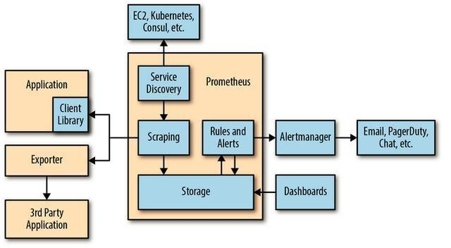

# prometheus

* [Prometheus](prometheus.md#prometheus)
  * [IO Doc](prometheus.md#io-doc)
  * [什么是 Prometheus？](prometheus.md#什么是-prometheus)
  * [Prometheus 的优势](prometheus.md#prometheus-的优势)
  * [Prometheus 适用于什么场景](prometheus.md#prometheus-适用于什么场景)
  * [Prometheus 不适合什么场景](prometheus.md#prometheus-不适合什么场景)
* [架构](prometheus.md#架构)
  * [Prometheus 组件内容](prometheus.md#prometheus-组件内容)
  * [工作原理](prometheus.md#工作原理)
  * [推方式和拉方式](prometheus.md#推方式和拉方式)
* [FYI](prometheus.md#fyi)

  **Prometheus**

### IO Doc

[prometheus.io](https://prometheus.io/)

### 什么是 Prometheus？

​Prometheus 是由前 Google 工程师从 2012 年开始在 Soundcloud 以开源软件的形式进行研发的系统监控和告警工具包，自此以后，许多公司和组织都采用了 Prometheus 作为监控告警工具.Prometheus 的开发者和用户社区非常活跃，它现在是一个独立的开源项目，可以独立于任何公司进行维护.为了证明这一点，Prometheus 于 2016 年 5 月加入 CNCF 基金会，成为继 Kubernetes 之后的第二个 CNCF 托管项目.

prometheus存储的是时序数据，即按相同时序\(相同名称和标签\)，以时间维度存储连续的数据的集合.

时序\(time series\)是由名字\(Metric\)以及一组key/value标签定义的，具有相同的名字以及标签属于相同时序 Prometheus主要用于对基础设施的监控.包括服务器，数据库，VPS，几乎所有东西都可以通过Prometheus进行监控.Prometheus希望通过对Prometheus配置中定义的某些端点执行的HTTP调用来检索度量标准.

### Prometheus 的优势

Prometheus 的主要优势有：

* 由指标名称和和键/值对标签标识的时间序列数据组成的多维数据模型.
* 强大的查询语言 PromQL.
* 不依赖分布式存储,单个服务节点具有自治能力.
* 时间序列数据是服务端通过 HTTP 协议主动拉取获得的.
* 也可以通过中间网关来推送时间序列数据.
* 可以通过静态配置文件或服务发现来获取监控目标.
* 支持多种类型的图表和仪表盘.

### Prometheus 适用于什么场景

Prometheus 适用于记录文本格式的时间序列，它既适用于以机器为中心的监控，也适用于高度动态的面向服务架构的监控.在微服务的世界中，它对多维数据收集和查询的支持有特殊优势.Prometheus 是专为提高系统可靠性而设计的，它可以在断电期间快速诊断问题，每个 Prometheus Server 都是相互独立的，不依赖于网络存储或其他远程服务.当基础架构出现故障时，你可以通过 Prometheus 快速定位故障点，而且不会消耗大量的基础架构资源.

### Prometheus 不适合什么场景

Prometheus 非常重视可靠性，即使在出现故障的情况下，你也可以随时查看有关系统的可用统计信息.如果你需要百分之百的准确度，例如按请求数量计费，那么 Prometheus 不太适合你，因为它收集的数据可能不够详细完整.这种情况下，你最好使用其他系统来收集和分析数据以进行计费，并使用 Prometheus 来监控系统的其余部分.

## 架构

Prometheus 的整体架构以及生态系统组件如下图所示：

Prometheus Server 直接从监控目标中或者间接通过推送网关来拉取监控指标，它在本地存储所有抓取到的样本数据，并对此数据执行一系列规则，以汇总和记录现有数据的新时间序列或生成告警.可以通过 Grafana 或者其他工具来实现监控数据的可视化.

### Prometheus 组件内容

Prometheus 生态系统由多个组件组成，其中有许多组件是可选的：

* Prometheus Server 负责从 Exporter 拉取和存储监控数据,并提供一套灵活的查询语言（PromQL）
  * Retrieval: 采样模块
  * TSDB: 存储模块默认本地存储为tsdb
  * HTTP Server: 提供http接口查询和面板，默认端口为9090

E\* xporters/Jobs 负责收集目标对象（host, container…）的性能数据，并通过 HTTP 接口供 Prometheus Server 获取。支持数据库、硬件、消息中间件、存储系统、http服务器、jmx等。只要符合接口格式，就可以被采集。

* Short-lived jobs 瞬时任务的场景，无法通过pull方式拉取，需要使用push方式，与PushGateway搭配使用
* PushGateway 可选组件，主要用于短期的 jobs。由于这类 jobs 存在时间较短，可能在 Prometheus 来 pull 之前就消失了。为此，这次 jobs 可以直接向 Prometheus server 端推送它们的 metrics。这种方式主要用于服务层面的 metrics，对于机器层面的 metrices，需要使用 node exporter。
* 客户端sdk 官方提供的客户端类库有go、java、scala、python、ruby，其他还有很多第三方开发的类库，支持nodejs、php、erlang等
* PromDash 使用rails开发的dashboard，用于可视化指标数据，已废弃
* Alertmanager 从 Prometheus server 端接收到 alerts 后，会进行去除重复数据，分组，并路由到对收的接受方式，发出报警。常见的接收方式有：电子邮件，pagerduty，OpsGenie, webhook 等。
* Service Discovery 服务发现，Prometheus支持多种服务发现机制：文件，DNS，Consul,Kubernetes,OpenStack,EC2等等。基于服务发现的过程并不复杂，通过第三方提供的接口，Prometheus查询到需要监控的Target列表，然后轮训这些Target获取监控数据。

其大概的工作流程是：

Prometheus server 定期从配置好的 jobs 或者 exporters 中拉 metrics，或者接收来自 Pushgateway 发过来的 metrics，或者从其他的 Prometheus server 中拉 metrics。 Prometheus server 在本地存储收集到的 metrics，并运行已定义好的 alert.rules，记录新的时间序列或者向 Alertmanager 推送警报。 Alertmanager 根据配置文件，对接收到的警报进行处理，发出告警。 在图形界面中，可视化采集数据。

### 工作原理

如前所述，Prometheus由各种不同的组件组成。其监控指标可以从系统中提取到，可以通过不同的方式做到：

通过应用程序给定监控项，对给定的公开URL上Prometheus兼容的指标。Prometheus将其定义为目标并加入监控系统。

通过使用云厂商内置Prometheus程序，会定义好整个监控项和监控工具集拥。例如，可以 Linux机器监控模版（节点导出器），数据库的模版（SQL导出器或MongoDB导出器），以及HTTP代理或者负载程序的模版（例如HAProxy导出器）等这些模版直接就可以加入监控并使用。

通过使用Pushgateway：应用程序或作业不会直接公开指标。某些应用程序要么没有合适的监控模版（例如批处理作业），对他们选择不能直接通过应用程序公开这些指标。如果我们忽略您可能使用Pushgateway的极少数情况，Prometheus是一个基于主动请求pull的监控系统。

### 推方式和拉方式

Prometheus与其他时间序列数据库之间存在明显差异：Prometheus主动筛选目标，以便从中检索指标。这与InfluxDB非常不同，InfluxDB是需要直接推送数据给它。

基于推和基于拉方式各有其优劣之处。Prometheus使用主动拉方式主要的基于以下考虑：

实现集中控制：如果Prometheus向其目标发起查询，则整个配置在Prometheus服务器端完成，而不是在各个目标上完成。Prometheus决定取值，以及取值的的频率。

使用基于推的系统，可能会导致向服务器发送过多数据的风险，这时会使其服务器崩溃。基于拉的系统能够实现速率控制，具有多级过期配置的灵活性，因此可以针对不同目标实现多种速率。

存储汇总的指标

Prometheus不是基于事件的系统，这与其他时间序列数据库不同。Prometheus并非旨在及时捕获单个和时间事件（例如服务中断），但它旨在收集有关的服务的预先汇总的指标。具体而言，它不会从Web服务发送404错误消息以及错误的消息的具体内容，而是对这些消息做处理、聚合过的指标。这与其他在收集"原始消息"的时间序列数据库之间的基本差异

## FYI

[prometheus-operator](https://github.com/coreos/prometheus-operator)

[kube-prometheus：用operator部署prometheus](https://github.com/coreos/kube-prometheus)

[prometheus/client\_python](https://github.com/prometheus/client_python)

[thanos](https://github.com/thanos-io/thanos)

[prometheus-book中文](https://github.com/yunlzheng/prometheus-book)

[基于Prometheus构建MySQL可视化监控平台](https://mp.weixin.qq.com/s/fYgKedgYtauD3CA4cQaLEg)

[打造云原生大型分布式监控系统\(一\):](https://mp.weixin.qq.com/s/QD9dvjBD0pkvdJwpS2999Q)

[打造云原生大型分布式监控系统\(二\):](https://mp.weixin.qq.com/s/KFPImAanIg11P91zOHFP2w)

