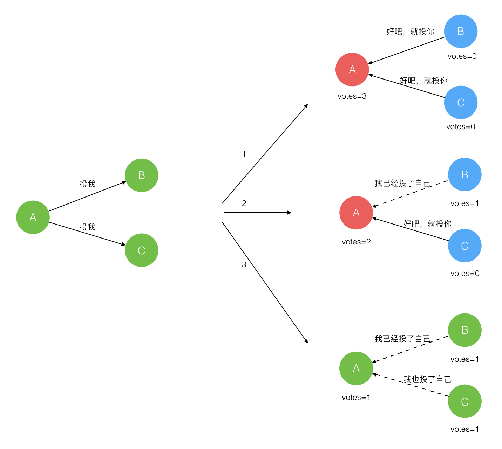
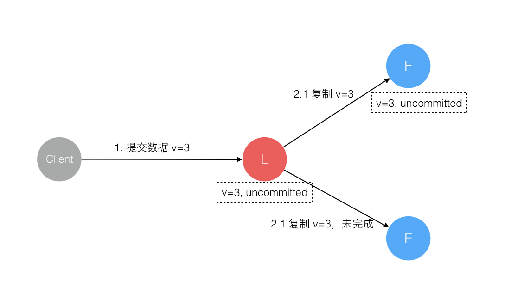
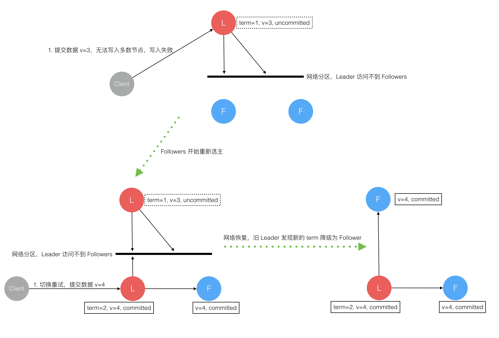

# raft

* [Raft](raft.md#raft)
  * [解决什么问题](raft.md#解决什么问题)
  * [概览](raft.md#概览)
  * [Raft算法流程](raft.md#raft算法流程)
    * [Term](raft.md#term)
    * [RPC](raft.md#rpc)
    * [选举流程](raft.md#选举流程)
      * [Leader 节点对一致性的影响](raft.md#leader-节点对一致性的影响)
        * [1 数据到达 Leader 节点前](raft.md#1-数据到达-leader-节点前)
        * [2 数据到达 Leader 节点，但未复制到 Follower 节点](raft.md#2-数据到达-leader-节点但未复制到-follower-节点)
        * [3 数据到达 Leader 节点，成功复制到 Follower 所有节点，但还未向 Leader 响应接收](raft.md#3-数据到达-leader-节点成功复制到-follower-所有节点但还未向-leader-响应接收)
        * [4 数据到达 Leader 节点，成功复制到 Follower 部分节点，但还未向 Leader 响应接收](raft.md#4-数据到达-leader-节点成功复制到-follower-部分节点但还未向-leader-响应接收)
        * [5 数据到达 Leader 节点，成功复制到 Follower 所有或多数节点，数据在 Leader 处于已提交状态，但在 Follower 处于未提交状态](raft.md#5-数据到达-leader-节点成功复制到-follower-所有或多数节点数据在-leader-处于已提交状态但在-follower-处于未提交状态)
        * [6 数据到达 Leader 节点，成功复制到 Follower 所有或多数节点，数据在所有节点都处于已提交状态，但还未响应 Client](raft.md#6-数据到达-leader-节点成功复制到-follower-所有或多数节点数据在所有节点都处于已提交状态但还未响应-client)
        * [网络分区导致的脑裂情况，出现双 Leader](raft.md#网络分区导致的脑裂情况出现双-leader)
    * [日志复制](raft.md#日志复制)
  * [Raft和Paxos的工程应用](raft.md#raft和paxos的工程应用)
    * [Raft的应用](raft.md#raft的应用)
    * [Zookeeper 中的 Paxos](raft.md#zookeeper-中的-paxos)
    * [如何解决split brain问题](raft.md#如何解决split-brain问题)
  * [从CAP的角度理解几种不同的算法](raft.md#从cap的角度理解几种不同的算法)

    **Raft**

### 解决什么问题

分布式存储系统通常通过维护多个副本来提高系统的availability，带来的代价就是分布式存储系统的核心问题之一：维护多个副本的一致性。

Raft协议基于复制状态机（replicated state machine），即一组server从相同的初始状态起，按相同的顺序执行相同的命令，最终会达到一直的状态，一组server记录相同的操作日志，并以相同的顺序应用到状态机。

### 概览

Raft算法将Server划分为3种状态，或者也可以称作角色：

* Leader\(领袖\)

  负责Client交互和log复制，同一时刻系统中最多存在1个。

* Follower（群众）

  被动响应请求RPC，从不主动发起请求RPC。

* Candidate（候选人）

  一种临时的角色，只存在于leader的选举阶段，某个节点想要变成leader，那么就发起投票请求，同时自己变成candidate。如果选举成功，则变为candidate，否则退回为follower

状态或者说角色的流转如下： 

在Raft中，问题分解为：领导选取、日志复制、安全和成员变化。

复制状态机通过复制日志来实现：

日志：每台机器保存一份日志，日志来自于客户端的请求，包含一系列的命令 状态机：状态机会按顺序执行这些命令 一致性模型：分布式环境下，保证多机的日志是一致的，这样回放到状态机中的状态是一致的

### Raft算法流程

Raft中使用心跳机制来触发leader选举。当服务器启动的时候，服务器成为follower。只要follower从leader或者candidate收到有效的RPCs就会保持follower状态。如果follower在一段时间内（该段时间被称为election timeout）没有收到消息，则它会假设当前没有可用的leader，然后开启选举新leader的流程。

#### Term

Term的概念类比中国历史上的朝代更替，Raft 算法将时间划分成为任意不同长度的任期（term）。

任期用连续的数字进行表示。每一个任期的开始都是一次选举（election），一个或多个候选人会试图成为领导人。如果一个候选人赢得了选举，它就会在该任期的剩余时间担任领导人。在某些情况下，选票会被瓜分，有可能没有选出领导人，那么，将会开始另一个任期，并且立刻开始下一次选举。Raft 算法保证在给定的一个任期最多只有一个领导人。

#### RPC

Raft 算法中服务器节点之间通信使用远程过程调用（RPCs），并且基本的一致性算法只需要两种类型的 RPCs，为了在服务器之间传输快照增加了第三种 RPC。

RPC有三种：

RequestVote RPC：候选人在选举期间发起

AppendEntries RPC：领导人发起的一种心跳机制，复制日志也在该命令中完成

InstallSnapshot RPC: 领导者使用该RPC来发送快照给太落后的追随者

#### 选举流程

在极简的思维下，一个最小的 Raft 民主集群需要三个参与者（如下图：A、B、C），这样才可能投出多数票。初始状态 ABC 都是 Follower，然后发起选举这时有三种可能情形发生。下图中前二种都能选出 Leader，第三种则表明本轮投票无效（Split Votes），每方都投给了自己，结果没有任何一方获得多数票。之后每个参与方随机休息一阵（Election Timeout）重新发起投票直到一方获得多数票。这里的关键就是随机 timeout，最先从 timeout 中恢复发起投票的一方向还在 timeout 中的另外两方请求投票，这时它们就只能投给对方了，很快达成一致。 

选出 Leader 后，Leader 通过定期向所有 Follower 发送心跳信息维持其统治。若 Follower 一段时间未收到 Leader 的心跳则认为 Leader 可能已经挂了再次发起选主过程。

**Leader 节点对一致性的影响**

Raft 协议强依赖 Leader 节点的可用性来确保集群数据的一致性。数据的流向只能从 Leader 节点向 Follower 节点转移。当 Client 向集群 Leader 节点提交数据后，Leader 节点接收到的数据处于未提交状态（Uncommitted），接着 Leader 节点会并发向所有 Follower 节点复制数据并等待接收响应，确保至少集群中超过半数节点已接收到数据后再向 Client 确认数据已接收。一旦向 Client 发出数据接收 Ack 响应后，表明此时数据状态进入已提交（Committed），Leader 节点再向 Follower 节点发通知告知该数据状态已提交。

在这个过程中，主节点可能在任意阶段挂掉，看下 Raft 协议如何针对不同阶段保障数据一致性的。

**1 数据到达 Leader 节点前**

这个阶段 Leader 挂掉不影响一致性，不多说。 

**2 数据到达 Leader 节点，但未复制到 Follower 节点**

这个阶段 Leader 挂掉，数据属于未提交状态，Client 不会收到 Ack 会认为超时失败可安全发起重试。Follower 节点上没有该数据，重新选主后 Client 重试重新提交可成功。原来的 Leader 节点恢复后作为 Follower 加入集群重新从当前任期的新 Leader 处同步数据，强制保持和 Leader 数据一致。 

**3 数据到达 Leader 节点，成功复制到 Follower 所有节点，但还未向 Leader 响应接收**

这个阶段 Leader 挂掉，虽然数据在 Follower 节点处于未提交状态（Uncommitted）但保持一致，重新选出 Leader 后可完成数据提交，此时 Client 由于不知到底提交成功没有，可重试提交。针对这种情况 Raft 要求 RPC 请求实现幂等性，也就是要实现内部去重机制。 

**4 数据到达 Leader 节点，成功复制到 Follower 部分节点，但还未向 Leader 响应接收**

这个阶段 Leader 挂掉，数据在 Follower 节点处于未提交状态（Uncommitted）且不一致，Raft 协议要求投票只能投给拥有最新数据的节点。所以拥有最新数据的节点会被选为 Leader 再强制同步数据到 Follower，数据不会丢失并最终一致。

**5 数据到达 Leader 节点，成功复制到 Follower 所有或多数节点，数据在 Leader 处于已提交状态，但在 Follower 处于未提交状态**

这个阶段 Leader 挂掉，重新选出新 Leader 后的处理流程和阶段 3 一样。 

**6 数据到达 Leader 节点，成功复制到 Follower 所有或多数节点，数据在所有节点都处于已提交状态，但还未响应 Client**

这个阶段 Leader 挂掉，Cluster 内部数据其实已经是一致的，Client 重复重试基于幂等策略对一致性无影响。 

**网络分区导致的脑裂情况，出现双 Leader**

网络分区将原先的 Leader 节点和 Follower 节点分隔开，Follower 收不到 Leader 的心跳将发起选举产生新的 Leader。这时就产生了双 Leader，原先的 Leader 独自在一个区，向它提交数据不可能复制到多数节点所以永远提交不成功。向新的 Leader 提交数据可以提交成功，网络恢复后旧的 Leader 发现集群中有更新任期（Term）的新 Leader 则自动降级为 Follower 并从新 Leader 处同步数据达成集群数据一致。 

#### 日志复制

日志复制（Log Replication）主要作用是用于保证节点的一致性，这阶段所做的操作也是为了保证一致性与高可用性。

当Leader选举出来后便开始负责客户端的请求，所有事务（更新操作）请求都必须先经过Leader处理，日志复制（Log Replication）就是为了保证执行相同的操作序列所做的工作。

在Raft中当接收到客户端的日志（事务请求）后先把该日志追加到本地的Log中，然后通过heartbeat把该Entry同步给其他Follower，Follower接收到日志后记录日志然后向Leader发送ACK，当Leader收到大多数（n/2+1）Follower的ACK信息后将该日志设置为已提交并追加到本地磁盘中，

### Raft和Paxos的工程应用

Raft算法的论文相比Paxos直观很多，更容易在工程上实现。

可以看到Raft算法的实现已经非常多了，[https://raft.github.io/\#implementations](https://raft.github.io/#implementations)

#### Raft的应用

这里用ETCD来关注Raft的应用，ETCD目标是构建一个高可用的分布式键值（key-value）数据库，基于 Go 语言实现。 Etcd 主要用途是共享配置和服务发现，实现一致性使用了Raft算法。 更多Etcd的应用可以查看文档：[https://coreos.com/etcd/docs/latest/](https://coreos.com/etcd/docs/latest/)

#### Zookeeper 中的 Paxos

Zookeeper 使用了一种修改后的 Paxos 协议。

在 Zookeeper 中，始终分为两种场景:

Leader activation 在这个场景里，系统中缺乏 Leader\(primary\)，通过一个类似 paxos 协议的过程完成 Leader 选举。

Active messaging 在 这个场景里，Leader 接收客户端发送的更新操作，以一种类似两阶段提交的过程在各个 follower \(secondary\)节点上进行更新操作。 在 Leader activation 场景中完成 leader 选举及数据同步后，系统转入 Active messaging 场景，在 active messaging 中 leader 异常后，系统转入 Leader activation 场景。

无论在那种场景，Zookeeper 依赖于一个全局版本号:zxid。zxid 由\(epoch, count\)两部分组成， 高位的 epoch 部分是选举编号，每次提议进行新的 leader 选举时 epoch 都会增加，低位的 count 部分 是 leader 为每个更新操作决定的序号。可以认为，一个 leader 对应一个唯一的 epoch，每个 leader 任期内产生的更新操作对应一个唯一的有序的 count，从而从全局的视野，一个 zxid 代表了一个更新操作的全局序号\(版本号\)。

Zookeeper 通过 zxid 将两个场景阶段较好的结合起来，且能保证全局的强一致性。由于同一时刻只有一个 zookeeper 节点能获得超过半数的 follower，所以同一时刻最多只存在唯一的 leader;每个 leader 利用 FIFO 以 zxid 顺序更新各个 follower，只有成功完成前一个更新操作的才会进行下一个更新操作，在同一个 leader 任期内，数据在全局满足 quorum 约束的强一致，即读超过半数的节点 一定可以读到最新已提交的数据;每个成功的更新操作都至少被超过半数的节点确认，使得新选举 的 leader 一定可以包括最新的已成功提交的数据。

#### 如何解决split brain问题

分布式协议一个著名问题就是 split brain 问题。

简单说，就是比如当你的 cluster 里面有两个结点，它们都知道在这个 cluster 里需要选举出一个 master。那么当它们两之间的通信完全没有问题的时候，就会达成共识，选出其中一个作为 master。但是如果它们之间的通信出了问题，那么两个结点都会觉得现在没有 master，所以每个都把自己选举成 master。于是 cluster 里面就会有两个 master。

区块链的分叉其实类似分布式系统的split brain。

一般来说，Zookeeper会默认设置：

zookeeper cluster的节点数目必须是奇数。 zookeeper 集群中必须超过半数节点\(Majority\)可用，整个集群才能对外可用。 Majority 就是一种 Qunroms 的方式来支持Leader选举，可以防止 split brain出现。奇数个节点可以在相同容错能力的情况下节省资源。

### 从CAP的角度理解几种不同的算法

1.两阶段提交协议 两阶段提交系统具有完全的C，很糟糕的A，很糟糕的P。 首先，两阶段提交协议保证了副本间是完全一致的，这也是协议的设计目的。再者，协议在一个节点出现异常时，就无法更新数据，其服务可用性较低。最后，一旦协调者与参与者之间网络分化，无法提供服务。

2.Paxos和Raft算法 Paxos 协议和Raft算法都是强一致性协议。Paxos只有两种情况下服务不可用:一是超过半数的 Proposer 异常，二是出现活锁。前者可以通过增加 Proposer 的个数来 降低由于 Proposer 异常影响服务的概率，后者本身发生的概率就极低。最后，只要能与超过半数的 Proposer 通信就可以完成协议流程，协议本身具有较好的容忍网络分区的能力。

